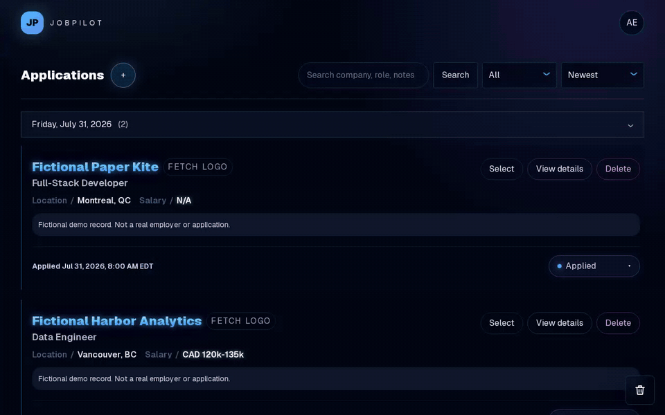
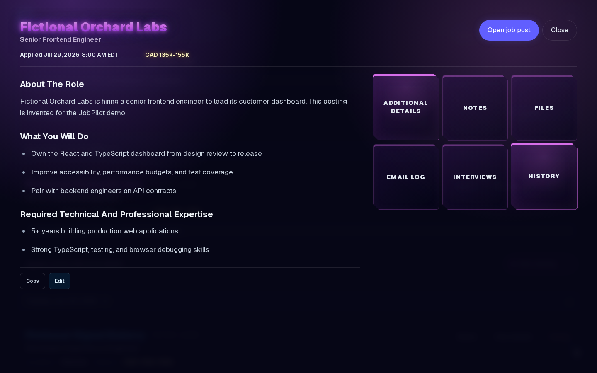
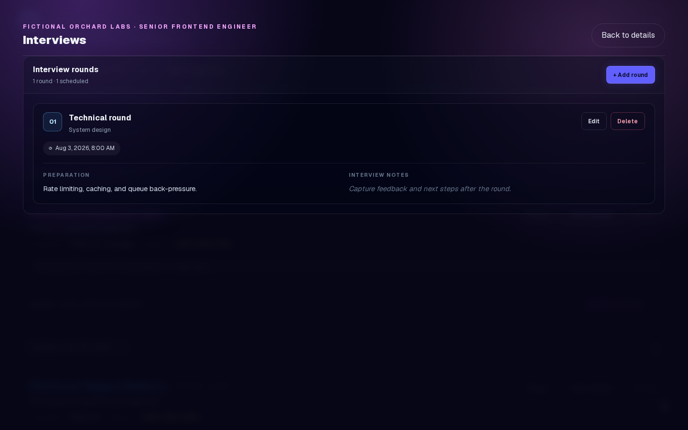
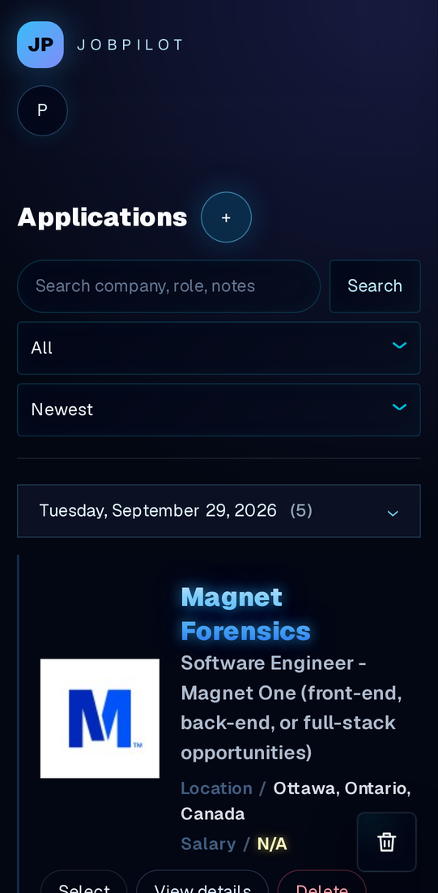
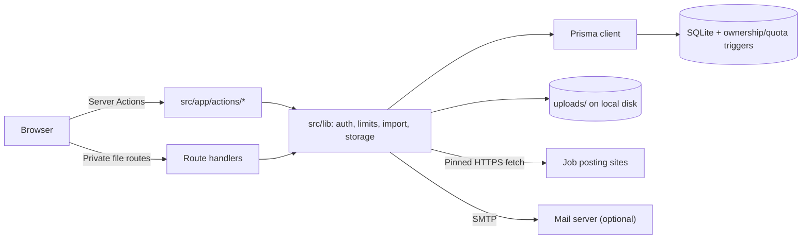

# JobPilot

[](https://github.com/pietrovos/jobpilot/actions/workflows/ci.yml)
[](https://github.com/pietrovos/jobpilot/actions/workflows/security.yml)
[](LICENSE)


JobPilot is a self-hosted job application tracker built with Next.js, Prisma,
and SQLite. It keeps applications, notes, interviews, email logs, and documents
in one place. The data stays on the machine or server running the application.



<sub>The walkthrough and the mobile screenshot show my own job search. The
application detail and interview screenshots use the fictional demo seed
described in the [demo capture guide](docs/demo-capture.md).</sub>

## Features

- Paste a job posting link to fill in the company, role, location, salary,
  logo, and description. Greenhouse, Lever, SmartRecruiters, Workable, and
  Workday are read through their public job APIs, LinkedIn through its public
  guest pages, and other sites through the structured job data most career
  pages publish.
- A "Save to JobPilot" bookmark button for sites that block automated reading,
  such as Indeed. It reads the posting from the page open in your browser.
- Search, filter by status, sort, drag to reorder, and group applications by
  the day you applied
- Three dashboard layouts: detailed cards, a compact list, and a board with a
  column per status where dragging a card changes its status
- For each application: status history, notes in folders, interview rounds,
  an email log, offer details, and file attachments
- A document library, so a resume is stored once and attached to many
  applications
- A recycle bin that keeps deleted applications, with everything attached to
  them, for 30 days
- Guest mode for trying the app without an account, then keeping the work by
  signing up
- Email and password login with password reset, plus optional Google, GitHub,
  and LinkedIn sign-in
- Data export and account deletion from settings

| Application details | Interview rounds | Mobile |
| --- | --- | --- |
|  |  |  |

## Engineering highlights

- Every query is scoped to the signed-in account, and SQLite triggers also
  reject notes, files, and interviews whose owner differs from their
  application's owner.
- Signing up moves the whole guest workspace inside one database transaction,
  so a failure cannot leave records split between two owners.
- The job-page importer fetches public HTTPS pages only. It checks every
  redirect, rejects private addresses, pins the resolved IP, and caps response
  size and time. JSON is only fetched from known job-site APIs, and logos only
  from known CDNs or the job page's own site. The parsers are separate modules
  tested against recorded fixtures.
- Images are decoded and re-encoded before they can be previewed, file types
  are checked by content, and storage quotas are enforced in the database.
- Deleting an application only marks it. Restoring it brings back its notes,
  files, interviews, and history unchanged.
- Playwright runs the main workflows in desktop and mobile Chromium against a
  production build.



## Running it with Docker

Docker Compose sets up Node, SQLite, and persistent storage for the database and
uploads:

```bash
docker compose up --build
```

Open http://localhost:3000 and create an account. To delete the local Docker
data, run `docker compose down --volumes`.

## Running it locally

The project uses Node 24.21.0, recorded in `.nvmrc`.

```bash
nvm use
npm ci
cp .env.example .env
npm run prisma:generate
npm run db:deploy
npm run dev
```

Set `DATABASE_URL` in `.env` to an absolute SQLite URL, such as
`file:/home/you/projects/jobpilot/dev.db`. Uploaded files go in `uploads/`.
Git ignores both locations because they can contain private information.

## Social sign-in

Login can use Google, GitHub, or LinkedIn alongside email and password. Create
an OAuth app with each provider you want, register
`https://<your-host>/api/auth/oauth/<provider>/callback` as the redirect URI,
and set the matching `*_CLIENT_ID` and `*_CLIENT_SECRET` values from
`.env.example`. A provider stays hidden until both of its values are present, so
leaving them unset keeps password-only login.

Accounts created through a provider have no password. They can set one later
from Account settings, where providers can also be connected or disconnected. An
account must keep at least one working sign-in method. A provider email is only
trusted to create a new account, never to attach itself to an existing one;
connecting a provider to an existing account happens from settings while signed
in. LinkedIn does not report whether its email is verified, so LinkedIn can only
create an account, not link to one.

## Password reset

The "Forgot password?" link appears once mail is configured. Set `APP_URL` to
the public origin, `SMTP_URL` to your provider's SMTP URL, and `MAIL_FROM` to
the sender address. Reset links are built from `APP_URL` rather than the
request's Host header. They expire after 30 minutes and work once, and using
one signs the account out everywhere. For local testing, set `MAIL_OUTBOX` to a
directory and each message is written there as a JSON file.

## How it is put together

JobPilot uses the Next.js App Router and React for the interface. Server Actions
handle changes to application data, and Prisma queries scope records to the
current account. Private files are returned through authenticated route
handlers instead of being placed in a public directory.

The job-page importer fetches public HTTPS pages from any host. It resolves the
host itself, rejects private and reserved IPv4 addresses, pins the connection
to the checked address, re-checks every redirect, and limits response size and
duration. Autofill is limited to 20 fetches per user per hour. The bookmark
button sends what it reads in the URL fragment, which never reaches server
logs, and the server validates it like any other form input. Uploaded images are decoded and written back in a known
format. PDFs and text files are always served as downloads.

The application is designed for one Node process with persistent local storage.
See [deployment](docs/deployment.md) for that setup. The
[demo capture guide](docs/demo-capture.md) explains how to seed fictional data
for screenshots or a recording.

## Tests and checks

```bash
npm run lint
npm run typecheck
npm test
npm run build
npm run test:e2e
npm audit --audit-level=moderate
```

The backend tests create temporary SQLite databases. They cover migrations,
ownership rules, guest transfer, soft deletion, uploads, private file delivery,
and URL-fetch restrictions. Playwright runs the main workflows in desktop and
mobile Chromium, including authentication, applications, notes, documents,
attachments, account settings, and guest conversion.

GitHub Actions runs the same lint, type-check, test, build, browser-test, and
dependency-audit steps on each change.

Other useful commands:

| Command | Purpose |
| --- | --- |
| `npm run db:deploy` | Apply committed migrations |
| `npm run db:seed:demo` | Seed an empty database with fictional demo data |
| `npm run maintenance:cleanup` | Report expired records and orphaned files |

## Security limits

Passwords are hashed, session tokens are stored as hashes, and production
cookies are HTTP-only and secure. Authenticated database queries and file routes
check record ownership. SQLite triggers also enforce ownership and storage
quotas at the database layer.

Login is rate-limited per account. Signup, login, and guest creation are also
limited globally, or per client once `TRUSTED_PROXY_IP_HEADER` names the header
your reverse proxy sets. Imports and uploads have rate limits too. Uploads have
type and size limits. Raster images can be previewed after they are decoded and
rewritten; PDFs are not sanitized. Guest workspaces expire after 24 hours, and
deleted applications remain recoverable for 30 days.

Email verification is not implemented. Provider sign-in verifies control of
the provider account, not of the local email address, and LinkedIn does not
report email verification at all. A real deployment still
needs HTTPS, monitoring, host-level resource limits, and tested backups. SQLite
and local uploads also rule out ephemeral or multi-replica hosting.

Planned work is listed in [development notes](docs/polish-roadmap.md).

## License

[MIT](LICENSE)
